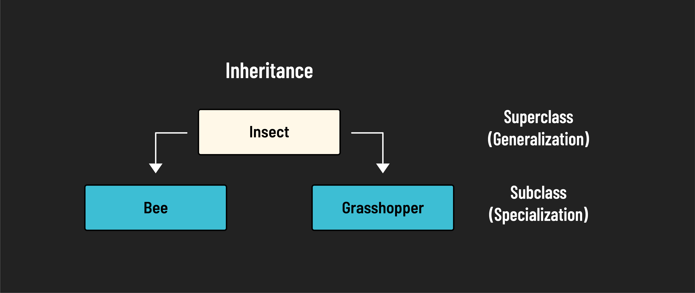
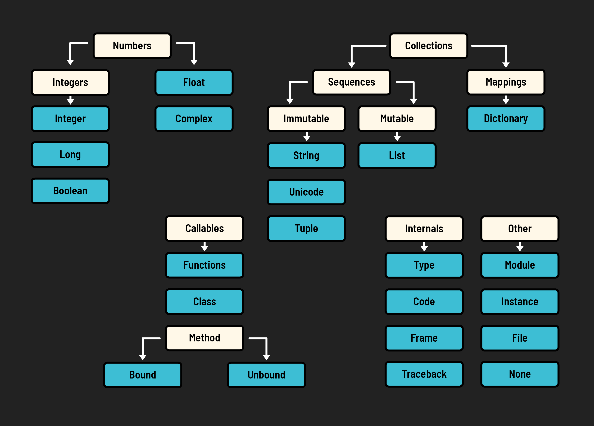

<h1>
  <span class="headline">Classes</span>
  <span class="subhead">Inheritance</span>
</h1>

**Learning objective:** By the end of this lesson, students will be able to demonstrate inheritance through generating subclasses.

## Inheritance

Inheritance is a powerful feature in object-oriented programming that allows a class (known as a ***subclass***) to inherit attributes and methods from another class (called a ***superclass***). This enables the subclass to reuse code from the superclass without having to rewrite it.

The subclass can then add its own unique attributes and methods, making it more specialized than the superclass.



Let's see how inheritance is implemented in Python by creating a `ShowDog` class that specializes the `Dog` class:

```python
class ShowDog(Dog):
    # add additional parameters AFTER those in the superclass
    def __init__(self, name, age=0, total_earnings=0):
        # always call the superclass's __init__ first
        Dog.__init__(self, name, age)
        # then add any new attributes
        self.total_earnings = total_earnings

    # add additional methods
    def add_prize_money(self, amount):
        self.total_earnings += amount
        print(f'{self.name}\'s new total earnings are ${self.total_earnings}')
```

> 🧠 If not specified, the default superclass is Python's `object` class. This is how we get methods like `__str__()`.

It's show time!

```python
winky = ShowDog('Winky', 3, 1000)

print(winky)
# prints: Dog #3 named Winky is 3 years old.

winky.bark()  
# prints: Winky says woof!
# the `ShowDog` class inherited the `Dog` class' `__str__()` and `bark()` method

print(winky.total_earnings)
# prints: 1000

winky.add_prize_money(500)
# a new method that instances of the 'Dog' class don't have

print(winky.total_earnings)
# prints: 1500
# go Winky go!
```

Inheritance is critical to OOP languages. They even have their own **object hierarchies**.

Check it out:



Frameworks like Django have elaborate object hierarchies of their own. For example in Django, Models are defined by inheriting from a Django class like this:

```python
class Person(models.Model):
```
